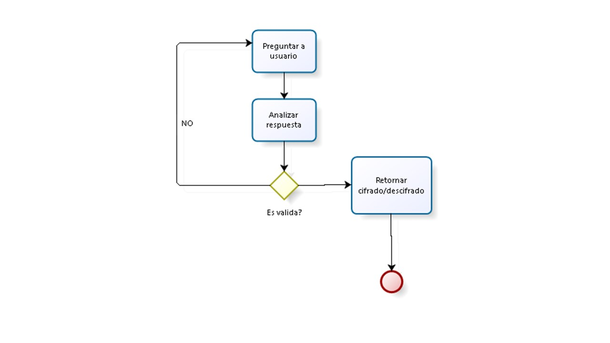

# CIFRADO CESAR:
### 1. Tu código debe estar compuesto por 2 funciones con los siguientes nombres: cipher y decipher
### 2. El usuario no debe poder ingresar un campo vacío o que contenga números
### 3. obtener el código js de las letras proporcionadas
### 4. convertir a la posición del alfabeto 
### 5. aplicar la formula pasar posición  código js

#PSEUDOCÓDIGO
##1.HTML
<!DOCTYPE html>
	<html lang="en">
	<head>
		<meta charset="UTF-8">
		<title>"CIFRADO CESAR"</title>
	</head>

<h1>"Transformando a Cifrado Cesar"</h1>
<h2>Favor responder la pregunta:</h2>
	<body>
		
 El Cifrado Cesar lleva el nombre de Julio César , 
		que según Suetonio , utilizo un cifrado para proteger mensajes de importancia militar. 

		
	</body>
	</html>	

##2.JS
// promp que solicite frase a encriptar, el cual tendrá el parámetro de la función

var codeToModify= prompt("Introduzca una frase que quiera encriptar:");

function cipher(sentence){
// genero un array vacio para los caracteres a trasformar
var answer='';
//paso a mayusculas el string de prompt para tener menos dificultad al decifrar código e
en la posición del alfabeto

sentence = sentence.toUpperCase();

// recorrer sentence y saber cuáles son los carácteres a decifrar	
	for(var i = 0; i < sentence.length; i++) {
// verificar que prompt no sea vacio ni número, utilizo typeof para que reconozca el tipo de dato	  
	  if(codeToModify !== ( ) && !== codeToModify typeof number ) {
	    if else( codeToModify = sentence){
	      answer+= sentence.charAt(i);
//una vez recorrido con for, saber cuántos carácteres hay que encriptar	      
	   }
	    else { String.fromCharCode( sentence.charCodeAt(i)- 65 + 33) % 26 + 65
	}
//fórmula cifrado cesar + acci y transformando en string nuevamente	  
	   
	   return answer;  //retornar array con los elementos
   }*

